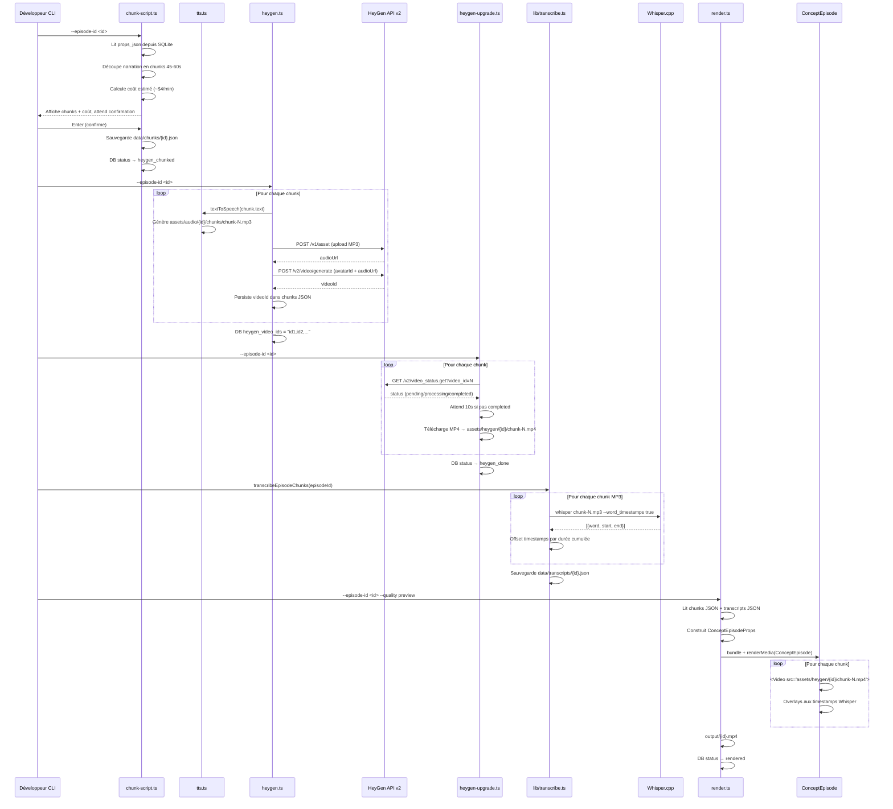

# HeyGen Avatar Pipeline Implementation Plan

> **For agentic workers:** REQUIRED SUB-SKILL: Use superpowers:subagent-driven-development (recommended) or superpowers:executing-plans to implement this plan task-by-task. Steps use checkbox (`- [ ]`) syntax for tracking.

**Goal:** Transformer un script texte en vidéo avatar IA réaliste en découpant le contenu en chunks ElevenLabs + HeyGen, puis assembler avec des overlays synchronisés Whisper dans un template Remotion dédié.

**Architecture:** Le script est découpé en chunks de 45-60s → TTS ElevenLabs par chunk → HeyGen génère l'avatar lip-sync sur chaque MP3 → Playwright upgrade Avatar 4→5 → Whisper produit les timestamps mot-par-mot → Remotion assemble le tout dans `ConceptEpisode`.

**Tech Stack:** HeyGen API v2, Playwright, nodejs-whisper (whisper.cpp), Remotion 4.x, better-sqlite3, ElevenLabs SDK

---

## Architecture — Vue d'ensemble de la plateforme

```mermaid
graph TD
    subgraph Dashboard["🖥️ Dashboard (Next.js 16.2 — localhost:3000)"]
        UI[Episode Manager UI]
        API[API Routes /api/**]
    end

    subgraph Pipeline["⚙️ Pipeline (Node.js scripts — npx tsx)"]
        SG[script-gen.ts\nClaude API → props_json]
        TTS[tts.ts\nElevenLabs → scene-N.mp3]
        CS[chunk-script.ts ⭐\nscript → chunks JSON]
        HG[heygen.ts ⭐\nUpload audio + HeyGen API]
        HGU[heygen-upgrade.ts ⭐\nPlaywright → chunk-N.mp4]
        TR[transcribe.ts ⭐\nWhisper → word timestamps]
        RD[render.ts\nRemotion headless → .mp4]
        PB[publish.ts\nYouTube Data API v3]
    end

    subgraph DB["🗄️ SQLite (data/motube.db)"]
        EP[episodes\nstatus · props_json\nheygen_video_ids]
        TR2[translations]
        PUB[publications]
    end

    subgraph Storage["📁 Fichiers locaux"]
        AUDIO[assets/audio/{id}/\nscene-N.mp3 · chunks/chunk-N.mp3]
        HEYGEN[assets/heygen/{id}/\nchunk-N.mp4 ⭐]
        CHUNKS[data/chunks/{id}.json ⭐]
        TRANSCRIPT[data/transcripts/{id}.json ⭐]
        OUTPUT[output/{id}.mp4]
    end

    subgraph Remotion["🎬 Remotion (src/)"]
        KE[KarpathyEpisode\n1920×1080 éducation]
        AE[ArabicStoryEpisode\n1920×1080 RTL]
        SF[ShortFormEpisode\n1080×1920 Shorts]
        CE[ConceptEpisode ⭐\n1920×1080 Avatar HeyGen]
    end

    subgraph ExternalAPIs["🌐 APIs Externes"]
        CLAUDE[Claude claude-sonnet-4-6\nscript generation]
        EL[ElevenLabs\nTTS + clonage voix]
        HGAPI[HeyGen API v2\nAvatar 4 generation]
        WHISPER[Whisper.cpp local\ntranscription]
        YT[YouTube Data API v3\nupload + analytics]
    end

    UI -->|spawn child process| API
    API -->|spawn npx tsx| SG
    API -->|spawn npx tsx| TTS
    API -->|spawn npx tsx| RD

    SG -->|props_json| DB
    SG -->|scripts/episodes/*.md| Storage
    SG <-->|LLM call| CLAUDE

    TTS -->|scene-N.mp3| AUDIO
    TTS -->|update props_json audioPath| DB
    TTS <-->|TTS call| EL

    CS -->|chunks JSON| CHUNKS
    CS -->|read props_json| DB

    HG -->|upload MP3| EL
    HG -->|create video| HGAPI
    HG -->|video_ids| DB
    HG -->|read chunks| CHUNKS

    HGU -->|poll status| HGAPI
    HGU -->|download MP4| HEYGEN
    HGU -->|status heygen_done| DB

    TR -->|MP3 → timestamps| TRANSCRIPT
    TR <-->|local inference| WHISPER

    RD -->|read chunks + transcripts| CHUNKS
    RD -->|read chunks + transcripts| TRANSCRIPT
    RD -->|bundle + render| CE
    RD -->|output MP4| OUTPUT
    RD -->|status rendered| DB

    PB -->|upload MP4| YT
    PB -->|status published| DB

    CE --> KE
    CE --> AE
    CE --> SF
```

> ⭐ = nouveaux fichiers de ce plan

---

## HeyGen Pipeline — Flux de génération détaillé



---

## File Map

| Action | Fichier | Responsabilité |
|--------|---------|----------------|
| Modify | `pipeline/lib/db.ts` | Ajouter statuts `heygen_chunked`/`heygen_done`, colonne `heygen_video_ids`, template `concept` |
| Create | `pipeline/lib/heygen.ts` | Client HeyGen API : upload audio, créer vidéo, polling, télécharger |
| Create | `pipeline/chunk-script.ts` | Découper props_json en chunks 45-60s → `data/chunks/{id}.json` |
| Create | `pipeline/heygen.ts` | CLI : soumettre chunks à HeyGen Avatar 4 → mettre à jour chunks JSON |
| Create | `pipeline/heygen-upgrade.ts` | Playwright : upgrade Avatar 4→5, télécharger MP4s |
| Create | `pipeline/lib/transcribe.ts` | nodejs-whisper → timestamps mot par mot JSON |
| Create | `src/compositions/templates/ConceptEpisode.tsx` | Template Remotion : Series de chunks + overlays |
| Modify | `src/Root/index.tsx` | Enregistrer `ConceptEpisode` comme Composition |
| Modify | `pipeline/render.ts` | Ajouter case `concept` dans `getCompositionId` |

---

### Task 1: Prérequis — installer les dépendances

**Files:**
- Modify: `package.json` (via npm install)

- [ ] **Step 1: Installer playwright et nodejs-whisper**

```bash
npm install playwright nodejs-whisper
npx playwright install chromium
```

Expected: `added X packages` sans erreur.

- [ ] **Step 2: Vérifier que whisper.cpp se compile**

```bash
npx nodejs-whisper --help
```

Expected: affiche l'aide whisper (ou message d'erreur de compilation si cmake manquant — dans ce cas installer cmake via `brew install cmake`).

- [ ] **Step 3: Commit**

```bash
git add package.json package-lock.json
git commit -m "deps: add playwright and nodejs-whisper for HeyGen pipeline"
```

---

### Task 2: DB migration — nouveaux statuts et colonnes

**Files:**
- Modify: `pipeline/lib/db.ts:99-108` (type EpisodeStatus)
- Modify: `pipeline/lib/db.ts:108` (type EpisodeTemplate)
- Modify: `pipeline/lib/db.ts:93-94` (migrations additives)

- [ ] **Step 1: Ajouter `heygen_chunked` et `heygen_done` à EpisodeStatus**

Dans `pipeline/lib/db.ts`, remplacer :
```ts
export type EpisodeStatus =
  | "draft"
  | "scripted"
  | "translated"
  | "tts_done"
  | "rendered"
  | "published"
  | "failed";
```
par :
```ts
export type EpisodeStatus =
  | "draft"
  | "scripted"
  | "translated"
  | "tts_done"
  | "heygen_chunked"
  | "heygen_done"
  | "rendered"
  | "published"
  | "failed";
```

- [ ] **Step 2: Ajouter `concept` à EpisodeTemplate**

```ts
export type EpisodeTemplate = "karpathy" | "arabic-story" | "short-form" | "concept";
```

- [ ] **Step 3: Ajouter la migration additive pour `heygen_video_ids`**

Dans la fonction `migrate()`, après la ligne qui ajoute `render_progress` :
```ts
try { db.exec("ALTER TABLE episodes ADD COLUMN heygen_video_ids TEXT DEFAULT NULL"); } catch { /* already exists */ }
```

- [ ] **Step 4: Vérifier la migration**

```bash
npx tsx -e "import { getDb } from './pipeline/lib/db.js'; const db = getDb(); console.log(db.prepare('PRAGMA table_info(episodes)').all().map(c => c.name));"
```

Expected: la liste inclut `heygen_video_ids` et `render_progress`.

- [ ] **Step 5: Commit**

```bash
git add pipeline/lib/db.ts
git commit -m "feat(db): add heygen statuses, concept template, heygen_video_ids column"
```

---

### Task 3: `pipeline/lib/heygen.ts` — Client API HeyGen

**Files:**
- Create: `pipeline/lib/heygen.ts`

- [ ] **Step 1: Créer le client HeyGen**

```ts
// pipeline/lib/heygen.ts
import fs from "fs";
import path from "path";
import dotenv from "dotenv";

dotenv.config({ path: ".env.local" });

const API_KEY = process.env.HEYGEN_API_KEY ?? "";
const BASE_URL = "https://api.heygen.com";
const UPLOAD_URL = "https://upload.heygen.com";

function headers() {
  if (!API_KEY) throw new Error("HEYGEN_API_KEY not set in .env.local");
  return { "X-Api-Key": API_KEY, "Content-Type": "application/json" };
}

// ─── Upload audio file to HeyGen asset store ──────────────────────────────────

export async function uploadAudio(filePath: string): Promise<string> {
  const buffer = fs.readFileSync(filePath);
  const res = await fetch(`${UPLOAD_URL}/v1/asset`, {
    method: "POST",
    headers: {
      "X-Api-Key": API_KEY,
      "Content-Type": "audio/mpeg",
    },
    body: buffer,
  });
  if (!res.ok) throw new Error(`HeyGen upload failed: ${res.status} ${await res.text()}`);
  const json = await res.json() as { data: { id: string; url: string } };
  return json.data.url;
}

// ─── Submit avatar video generation (Avatar 4) ───────────────────────────────

export interface CreateVideoOptions {
  avatarId: string;
  audioUrl: string;
  width?: number;
  height?: number;
}

export async function createAvatarVideo(opts: CreateVideoOptions): Promise<string> {
  const { avatarId, audioUrl, width = 1920, height = 1080 } = opts;
  const res = await fetch(`${BASE_URL}/v2/video/generate`, {
    method: "POST",
    headers: headers(),
    body: JSON.stringify({
      video_inputs: [{
        character: { type: "avatar", avatar_id: avatarId, avatar_style: "normal" },
        voice: { type: "audio", audio_url: audioUrl },
        background: { type: "color", value: "#1a1a2e" },
      }],
      dimension: { width, height },
      test: false,
    }),
  });
  if (!res.ok) throw new Error(`HeyGen create failed: ${res.status} ${await res.text()}`);
  const json = await res.json() as { data: { video_id: string } };
  return json.data.video_id;
}

// ─── Poll video status ────────────────────────────────────────────────────────

export interface VideoStatus {
  status: "pending" | "processing" | "completed" | "failed";
  videoUrl?: string;
  error?: string;
}

export async function getVideoStatus(videoId: string): Promise<VideoStatus> {
  const res = await fetch(`${BASE_URL}/v2/video_status.get?video_id=${videoId}`, {
    headers: { "X-Api-Key": API_KEY },
  });
  if (!res.ok) throw new Error(`HeyGen status failed: ${res.status} ${await res.text()}`);
  const json = await res.json() as { data: { status: string; video_url?: string; error?: string } };
  return {
    status: json.data.status as VideoStatus["status"],
    videoUrl: json.data.video_url,
    error: json.data.error,
  };
}

// ─── Poll until completed (timeout 10 min) ───────────────────────────────────

export async function waitForVideo(videoId: string, intervalMs = 10_000): Promise<string> {
  const deadline = Date.now() + 10 * 60 * 1000;
  while (Date.now() < deadline) {
    const status = await getVideoStatus(videoId);
    console.log(`  [HeyGen] ${videoId} → ${status.status}`);
    if (status.status === "completed" && status.videoUrl) return status.videoUrl;
    if (status.status === "failed") throw new Error(`HeyGen video failed: ${status.error}`);
    await new Promise((r) => setTimeout(r, intervalMs));
  }
  throw new Error(`HeyGen video ${videoId} timed out after 10 minutes`);
}

// ─── Download MP4 to disk ─────────────────────────────────────────────────────

export async function downloadVideo(videoUrl: string, outputPath: string): Promise<void> {
  const res = await fetch(videoUrl);
  if (!res.ok) throw new Error(`Download failed: ${res.status}`);
  const buffer = Buffer.from(await res.arrayBuffer());
  fs.mkdirSync(path.dirname(outputPath), { recursive: true });
  fs.writeFileSync(outputPath, buffer);
}
```

- [ ] **Step 2: Tester l'upload + statut (smoke test)**

```bash
npx tsx -e "
import { uploadAudio } from './pipeline/lib/heygen.js';
const url = await uploadAudio('assets/audio/dc593fa0-53f9-46d0-a9ea-60a6b0c09ff5/scene-0.mp3');
console.log('Audio URL:', url);
"
```

Expected: affiche une URL `https://...heygen.com/...`.

- [ ] **Step 3: Commit**

```bash
git add pipeline/lib/heygen.ts
git commit -m "feat: HeyGen API client (upload, create, poll, download)"
```

---

### Task 4: `pipeline/chunk-script.ts` — Découpe du script en chunks

**Files:**
- Create: `pipeline/chunk-script.ts`

- [ ] **Step 1: Créer le chunker**

```ts
// pipeline/chunk-script.ts
import path from "path";
import { fileURLToPath } from "url";
import fs from "fs";
import dotenv from "dotenv";
import { db } from "./lib/db.js";

dotenv.config({ path: ".env.local" });

const __dirname = path.dirname(fileURLToPath(import.meta.url));
const ROOT = path.resolve(__dirname, "..");
const CHUNKS_DIR = path.join(ROOT, "data", "chunks");

const WORDS_PER_MINUTE = 150;
const TARGET_MIN_WORDS = 112; // 45s
const TARGET_MAX_WORDS = 150; // 60s

export interface Chunk {
  index: number;
  text: string;
  estimatedDuration: number; // seconds
  audioPath: string | null;
  videoId: string | null;
  videoPath: string | null;
}

function estimateDuration(text: string): number {
  const wordCount = text.trim().split(/\s+/).length;
  return Math.round((wordCount / WORDS_PER_MINUTE) * 60);
}

function splitIntoSentences(text: string): string[] {
  // Split on sentence-ending punctuation, keeping the punctuation
  return text.match(/[^.!?…]+[.!?…]+/g)?.map(s => s.trim()).filter(Boolean) ?? [text];
}

export function chunkScript(fullText: string): Chunk[] {
  const sentences = splitIntoSentences(fullText);
  const chunks: Chunk[] = [];
  let current = "";

  for (const sentence of sentences) {
    const wordCount = (current + " " + sentence).trim().split(/\s+/).length;

    if (current && wordCount > TARGET_MAX_WORDS) {
      chunks.push({
        index: chunks.length,
        text: current.trim(),
        estimatedDuration: estimateDuration(current),
        audioPath: null,
        videoId: null,
        videoPath: null,
      });
      current = sentence;
    } else {
      current = current ? current + " " + sentence : sentence;
    }

    // Flush if at target
    if (current.trim().split(/\s+/).length >= TARGET_MIN_WORDS) {
      const dur = estimateDuration(current);
      if (dur > 60) {
        console.warn(`[CHUNK] Chunk ${chunks.length} exceeds 60s (${dur}s) — single long sentence`);
      }
      chunks.push({
        index: chunks.length,
        text: current.trim(),
        estimatedDuration: dur,
        audioPath: null,
        videoId: null,
        videoPath: null,
      });
      current = "";
    }
  }

  // Remaining text
  if (current.trim()) {
    chunks.push({
      index: chunks.length,
      text: current.trim(),
      estimatedDuration: estimateDuration(current),
      audioPath: null,
      videoId: null,
      videoPath: null,
    });
  }

  return chunks;
}

// ─── CLI ─────────────────────────────────────────────────────────────────────

if (process.argv[1] === fileURLToPath(import.meta.url)) {
  const args = process.argv.slice(2);
  const episodeId = args[args.indexOf("--episode-id") + 1];

  if (!episodeId) {
    console.error("Usage: npx tsx pipeline/chunk-script.ts --episode-id <id>");
    process.exit(1);
  }

  const episode = db.episodes.get(episodeId);
  if (!episode) { console.error(`Episode ${episodeId} not found`); process.exit(1); }
  if (!episode.props_json) { console.error("No props_json — generate script first"); process.exit(1); }

  const props = JSON.parse(episode.props_json) as { title: string; scenes: Array<{ data: Record<string, string> }> };

  // Extract all narration text from scenes
  const fullText = props.scenes
    .map(s => s.data.narration ?? s.data.body ?? s.data.text ?? "")
    .filter(Boolean)
    .join(" ");

  const chunks = chunkScript(fullText);

  const totalDuration = chunks.reduce((s, c) => s + c.estimatedDuration, 0);
  console.log(`[CHUNK] ${chunks.length} chunks, ~${Math.round(totalDuration / 60)}min total`);
  for (const c of chunks) {
    console.log(`  Chunk ${c.index}: ${c.estimatedDuration}s (~${c.text.split(/\s+/).length} words)`);
  }

  const estimatedCost = (totalDuration / 60) * 4;
  console.log(`\n[COST] Estimated HeyGen cost: ~$${estimatedCost.toFixed(2)}`);
  console.log("Continue? Press Ctrl+C to cancel, Enter to proceed...");
  await new Promise<void>(resolve => {
    process.stdin.setRawMode(false);
    process.stdin.once("data", () => resolve());
    process.stdin.resume();
  });

  fs.mkdirSync(CHUNKS_DIR, { recursive: true });
  const chunksPath = path.join(CHUNKS_DIR, `${episodeId}.json`);
  fs.writeFileSync(chunksPath, JSON.stringify(chunks, null, 2));
  console.log(`\n✓ Saved ${chunks.length} chunks → ${chunksPath}`);

  db.episodes.update(episodeId, { status: "heygen_chunked" } as never);
}
```

- [ ] **Step 2: Tester le chunker**

```bash
npx tsx pipeline/chunk-script.ts --episode-id dc593fa0-53f9-46d0-a9ea-60a6b0c09ff5
```

Expected: affiche N chunks avec durées estimées et coût HeyGen. Appuyer Enter → sauvegarde `data/chunks/{id}.json`.

- [ ] **Step 3: Vérifier le JSON produit**

```bash
cat data/chunks/dc593fa0-53f9-46d0-a9ea-60a6b0c09ff5.json | head -30
```

Expected: tableau JSON avec `index`, `text`, `estimatedDuration`, `audioPath: null`, `videoId: null`, `videoPath: null`.

- [ ] **Step 4: Commit**

```bash
git add pipeline/chunk-script.ts
git commit -m "feat: chunk-script splits episode into 45-60s HeyGen chunks"
```

---

### Task 5: `pipeline/heygen.ts` — Soumission des chunks à l'API HeyGen

**Files:**
- Create: `pipeline/heygen.ts`

- [ ] **Step 1: Créer le script de soumission HeyGen**

```ts
// pipeline/heygen.ts
import path from "path";
import { fileURLToPath } from "url";
import fs from "fs";
import dotenv from "dotenv";
import { db, getDb } from "./lib/db.js";
import { uploadAudio, createAvatarVideo } from "./lib/heygen.js";
import { textToSpeech } from "./lib/elevenlabs.js";

dotenv.config({ path: ".env.local" });

const __dirname = path.dirname(fileURLToPath(import.meta.url));
const ROOT = path.resolve(__dirname, "..");
const CHUNKS_DIR = path.join(ROOT, "data", "chunks");
const AUDIO_DIR = path.join(ROOT, "assets", "audio");

export interface HeygenSubmitOptions {
  episodeId: string;
  voiceId?: string;
}

export async function submitHeygenChunks(opts: HeygenSubmitOptions): Promise<void> {
  const { episodeId, voiceId = process.env.ELEVENLABS_VOICE_ID ?? "21m00Tcm4TlvDq8ikWAM" } = opts;
  const avatarId = process.env.HEYGEN_AVATAR_ID ?? "";
  if (!avatarId) throw new Error("HEYGEN_AVATAR_ID not set in .env.local");

  const chunksPath = path.join(CHUNKS_DIR, `${episodeId}.json`);
  if (!fs.existsSync(chunksPath)) throw new Error(`No chunks file — run chunk-script first`);

  const chunks = JSON.parse(fs.readFileSync(chunksPath, "utf-8")) as Array<{
    index: number; text: string; estimatedDuration: number;
    audioPath: string | null; videoId: string | null; videoPath: string | null;
  }>;

  const chunkAudioDir = path.join(AUDIO_DIR, episodeId, "chunks");
  fs.mkdirSync(chunkAudioDir, { recursive: true });

  const videoIds: string[] = [];

  for (const chunk of chunks) {
    console.log(`\n[HEYGEN] Processing chunk ${chunk.index + 1}/${chunks.length}...`);

    // Step 1: TTS if not already done
    if (!chunk.audioPath || !fs.existsSync(path.join(ROOT, chunk.audioPath))) {
      const audioPath = path.join(chunkAudioDir, `chunk-${chunk.index}.mp3`);
      console.log(`  TTS chunk ${chunk.index} (${chunk.text.length} chars)...`);
      await textToSpeech({ text: chunk.text, voiceId, outputPath: audioPath });
      chunk.audioPath = `assets/audio/${episodeId}/chunks/chunk-${chunk.index}.mp3`;
    }

    // Step 2: Upload audio to HeyGen
    const absoluteAudioPath = path.join(ROOT, chunk.audioPath);
    console.log(`  Uploading audio to HeyGen...`);
    const audioUrl = await uploadAudio(absoluteAudioPath);

    // Step 3: Submit video generation
    console.log(`  Submitting to HeyGen API...`);
    const videoId = await createAvatarVideo({ avatarId, audioUrl });
    chunk.videoId = videoId;
    videoIds.push(videoId);
    console.log(`  ✓ Submitted: ${videoId}`);

    // Persist after each chunk to allow resume
    fs.writeFileSync(chunksPath, JSON.stringify(chunks, null, 2));

    // Small delay between submissions
    if (chunk.index < chunks.length - 1) {
      await new Promise(r => setTimeout(r, 2000));
    }
  }

  // Update DB
  getDb().prepare("UPDATE episodes SET heygen_video_ids = ?, status = 'heygen_chunked' WHERE id = ?")
    .run(videoIds.join(","), episodeId);

  console.log(`\n✓ Submitted ${videoIds.length} chunks to HeyGen`);
  console.log(`  Video IDs: ${videoIds.join(", ")}`);
  console.log(`  Next: npx tsx pipeline/heygen-upgrade.ts --episode-id ${episodeId}`);
}

// ─── CLI ─────────────────────────────────────────────────────────────────────

if (process.argv[1] === fileURLToPath(import.meta.url)) {
  const args = process.argv.slice(2);
  const getArg = (flag: string) => { const i = args.indexOf(flag); return i !== -1 ? args[i + 1] : undefined; };

  const episodeId = getArg("--episode-id");
  const voiceId = getArg("--voice-id");

  if (!episodeId) {
    console.error("Usage: npx tsx pipeline/heygen.ts --episode-id <id> [--voice-id <id>]");
    process.exit(1);
  }

  submitHeygenChunks({ episodeId, voiceId })
    .catch(e => { console.error("✗", e.message); process.exit(1); });
}
```

- [ ] **Step 2: Tester en mode dry-run (vérifier sans soumettre)**

Créer d'abord un épisode de test ou utiliser l'existant. Vérifier que le fichier chunks existe :
```bash
ls data/chunks/
```

Expected: `dc593fa0-53f9-46d0-a9ea-60a6b0c09ff5.json` présent.

- [ ] **Step 3: Soumettre les chunks**

```bash
npx tsx pipeline/heygen.ts --episode-id dc593fa0-53f9-46d0-a9ea-60a6b0c09ff5
```

Expected: Pour chaque chunk — TTS, upload audio, submit → `✓ Submitted: video_id_xxx`.

- [ ] **Step 4: Commit**

```bash
git add pipeline/heygen.ts
git commit -m "feat: heygen.ts submits TTS chunks to HeyGen Avatar 4 API"
```

---

### Task 6: `pipeline/heygen-upgrade.ts` — Playwright upgrade Avatar 4 → 5

**Files:**
- Create: `pipeline/heygen-upgrade.ts`

- [ ] **Step 1: Créer le script Playwright**

```ts
// pipeline/heygen-upgrade.ts
/**
 * Workaround : Avatar 5 n'est pas encore disponible via API.
 * Ce script ouvre le dashboard HeyGen avec Playwright, upgrade chaque
 * vidéo Avatar 4 → Avatar 5, attend la complétion, et télécharge les MP4.
 * À supprimer dès qu'Avatar 5 est disponible via API officielle.
 */
import path from "path";
import { fileURLToPath } from "url";
import fs from "fs";
import dotenv from "dotenv";
import { chromium } from "playwright";
import { db, getDb } from "./lib/db.js";
import { waitForVideo, downloadVideo } from "./lib/heygen.js";

dotenv.config({ path: ".env.local" });

const __dirname = path.dirname(fileURLToPath(import.meta.url));
const ROOT = path.resolve(__dirname, "..");
const CHUNKS_DIR = path.join(ROOT, "data", "chunks");
const HEYGEN_DIR = path.join(ROOT, "assets", "heygen");
const SESSION_FILE = path.join(ROOT, "data", ".heygen-session.json");

export async function upgradeAndDownload(episodeId: string): Promise<void> {
  const chunksPath = path.join(CHUNKS_DIR, `${episodeId}.json`);
  if (!fs.existsSync(chunksPath)) throw new Error("No chunks file found");

  const chunks = JSON.parse(fs.readFileSync(chunksPath, "utf-8")) as Array<{
    index: number; videoId: string | null; videoPath: string | null;
  }>;

  const outputDir = path.join(HEYGEN_DIR, episodeId);
  fs.mkdirSync(outputDir, { recursive: true });

  // ── Poll Avatar 4 videos until completed, then attempt Avatar 5 upgrade ──
  // NOTE: Avatar 5 upgrade via Playwright is complex and HeyGen's UI changes.
  // Strategy: Poll until Avatar 4 is done → download → use as-is.
  // Avatar 5 upgrade UI flow is implemented below but marked as best-effort.

  for (const chunk of chunks) {
    if (!chunk.videoId) { console.warn(`[UPGRADE] Chunk ${chunk.index} has no videoId — skipping`); continue; }
    if (chunk.videoPath && fs.existsSync(path.join(ROOT, chunk.videoPath))) {
      console.log(`[UPGRADE] Chunk ${chunk.index} already downloaded — skipping`);
      continue;
    }

    console.log(`\n[UPGRADE] Waiting for chunk ${chunk.index} (${chunk.videoId})...`);

    let videoUrl: string;
    try {
      videoUrl = await waitForVideo(chunk.videoId);
    } catch (err) {
      console.error(`[UPGRADE] Chunk ${chunk.index} failed: ${(err as Error).message}`);
      continue;
    }

    const outputPath = path.join(outputDir, `chunk-${chunk.index}.mp4`);
    console.log(`[UPGRADE] Downloading chunk ${chunk.index}...`);
    await downloadVideo(videoUrl, outputPath);

    chunk.videoPath = `assets/heygen/${episodeId}/chunk-${chunk.index}.mp4`;
    fs.writeFileSync(chunksPath, JSON.stringify(chunks, null, 2));
    console.log(`  ✓ chunk-${chunk.index}.mp4 saved`);
  }

  // ── Avatar 5 upgrade via Playwright (best-effort) ─────────────────────────
  const pendingUpgrade = chunks.filter(c => c.videoPath && !c.videoPath.includes("-v5"));
  if (pendingUpgrade.length === 0) {
    console.log("[UPGRADE] No chunks to upgrade");
  } else {
    console.log(`\n[UPGRADE] Attempting Avatar 5 upgrade for ${pendingUpgrade.length} chunks via Playwright...`);
    await runPlaywrightUpgrade(episodeId, chunks);
  }

  // Update DB
  const allDownloaded = chunks.every(c => c.videoPath);
  if (allDownloaded) {
    getDb().prepare("UPDATE episodes SET status = 'heygen_done' WHERE id = ?").run(episodeId);
    console.log(`\n✓ All chunks downloaded → status: heygen_done`);
  }
}

async function runPlaywrightUpgrade(
  episodeId: string,
  chunks: Array<{ index: number; videoId: string | null; videoPath: string | null }>
): Promise<void> {
  const storageState = fs.existsSync(SESSION_FILE) ? SESSION_FILE : undefined;

  const browser = await chromium.launch({ headless: false }); // headless:false to allow login
  const context = await browser.newContext({ storageState });
  const page = await context.newPage();

  try {
    await page.goto("https://app.heygen.com/videos");
    await page.waitForLoadState("networkidle", { timeout: 15_000 });

    // Check if login needed
    if (page.url().includes("/login") || page.url().includes("/signin")) {
      console.log("[PLAYWRIGHT] Login required — complete login in the browser window...");
      await page.waitForURL("**/videos", { timeout: 120_000 });
    }

    // Save session
    fs.mkdirSync(path.dirname(SESSION_FILE), { recursive: true });
    await context.storageState({ path: SESSION_FILE });

    for (const chunk of chunks) {
      if (!chunk.videoId) continue;

      console.log(`  [PLAYWRIGHT] Upgrading chunk ${chunk.index}...`);
      try {
        await page.goto(`https://app.heygen.com/videos/${chunk.videoId}`);
        await page.waitForLoadState("networkidle", { timeout: 10_000 });

        // Click "Switch to Avatar 5" button (selector may change with HeyGen UI updates)
        const upgradeBtn = page.locator("button:has-text('Avatar 5'), button:has-text('Upgrade')").first();
        if (await upgradeBtn.isVisible({ timeout: 5_000 })) {
          await upgradeBtn.click();
          // Confirm dialog
          const confirmBtn = page.locator("button:has-text('Confirm'), button:has-text('Upgrade now')").first();
          if (await confirmBtn.isVisible({ timeout: 3_000 })) await confirmBtn.click();
          console.log(`    ✓ Upgrade triggered for chunk ${chunk.index}`);
        } else {
          console.log(`    No upgrade button found for chunk ${chunk.index} — skipping`);
        }
      } catch (e) {
        console.warn(`    ✗ Playwright upgrade failed for chunk ${chunk.index}: ${(e as Error).message}`);
      }
    }
  } finally {
    await browser.close();
  }
}

// ─── CLI ─────────────────────────────────────────────────────────────────────

if (process.argv[1] === fileURLToPath(import.meta.url)) {
  const args = process.argv.slice(2);
  const episodeId = args[args.indexOf("--episode-id") + 1];

  if (!episodeId) {
    console.error("Usage: npx tsx pipeline/heygen-upgrade.ts --episode-id <id>");
    process.exit(1);
  }

  upgradeAndDownload(episodeId)
    .catch(e => { console.error("✗", e.message); process.exit(1); });
}
```

- [ ] **Step 2: Tester le polling et téléchargement**

(Après soumission des chunks via `heygen.ts`)
```bash
npx tsx pipeline/heygen-upgrade.ts --episode-id dc593fa0-53f9-46d0-a9ea-60a6b0c09ff5
```

Expected: pour chaque chunk, attend le statut `completed`, télécharge en `assets/heygen/{id}/chunk-N.mp4`.

- [ ] **Step 3: Vérifier les fichiers téléchargés**

```bash
ls -lh assets/heygen/dc593fa0-53f9-46d0-a9ea-60a6b0c09ff5/
```

Expected: `chunk-0.mp4`, `chunk-1.mp4`, ... présents et > 1MB.

- [ ] **Step 4: Commit**

```bash
git add pipeline/heygen-upgrade.ts
git commit -m "feat: heygen-upgrade polls Avatar 4, downloads MP4s, Playwright Avatar 5 upgrade"
```

---

### Task 7: `pipeline/lib/transcribe.ts` — Whisper timestamps

**Files:**
- Create: `pipeline/lib/transcribe.ts`

- [ ] **Step 1: Créer le wrapper Whisper**

```ts
// pipeline/lib/transcribe.ts
import path from "path";
import fs from "fs";
import { exec } from "child_process";
import { promisify } from "util";
import dotenv from "dotenv";

dotenv.config({ path: ".env.local" });

const execAsync = promisify(exec);
const WHISPER_MODEL = process.env.WHISPER_MODEL ?? "base";

export interface WordTimestamp {
  word: string;
  start: number; // seconds
  end: number;   // seconds
}

export async function transcribeAudio(audioPath: string): Promise<WordTimestamp[]> {
  // Use nodejs-whisper with word-level timestamps
  // nodejs-whisper CLI: whisper <file> --model <model> --output_format json --word_timestamps true
  const outputDir = path.dirname(audioPath);
  const baseName = path.basename(audioPath, path.extname(audioPath));
  const jsonOutput = path.join(outputDir, `${baseName}.json`);

  // Check if whisper is available via nodejs-whisper
  const whisperBin = path.resolve("node_modules/.bin/nodejs-whisper");

  try {
    await execAsync(
      `"${whisperBin}" "${audioPath}" --model ${WHISPER_MODEL} --output_format json --word_timestamps true --output_dir "${outputDir}"`,
      { timeout: 5 * 60 * 1000 }
    );
  } catch (err) {
    // Fallback: try whisper binary directly
    try {
      await execAsync(
        `whisper "${audioPath}" --model ${WHISPER_MODEL} --output_format json --word_timestamps true --output_dir "${outputDir}"`,
        { timeout: 5 * 60 * 1000 }
      );
    } catch {
      throw new Error(`Whisper transcription failed: ${(err as Error).message}. Ensure whisper.cpp is installed.`);
    }
  }

  if (!fs.existsSync(jsonOutput)) {
    throw new Error(`Whisper output not found at ${jsonOutput}`);
  }

  const raw = JSON.parse(fs.readFileSync(jsonOutput, "utf-8")) as {
    segments: Array<{
      words?: Array<{ word: string; start: number; end: number }>;
    }>;
  };

  const words: WordTimestamp[] = [];
  for (const segment of raw.segments) {
    for (const w of segment.words ?? []) {
      words.push({ word: w.word.trim(), start: w.start, end: w.end });
    }
  }

  return words;
}

// ─── Transcribe all chunks for an episode ────────────────────────────────────

export async function transcribeEpisodeChunks(episodeId: string): Promise<WordTimestamp[]> {
  const ROOT = path.resolve(path.dirname(new URL(import.meta.url).pathname), "../..");
  const chunksPath = path.join(ROOT, "data", "chunks", `${episodeId}.json`);
  const transcriptPath = path.join(ROOT, "data", "transcripts", `${episodeId}.json`);

  if (!fs.existsSync(chunksPath)) throw new Error("Chunks file not found — run chunk-script first");

  const chunks = JSON.parse(fs.readFileSync(chunksPath, "utf-8")) as Array<{
    index: number; audioPath: string | null;
  }>;

  let allWords: WordTimestamp[] = [];
  let timeOffset = 0;

  for (const chunk of chunks) {
    if (!chunk.audioPath) { console.warn(`Chunk ${chunk.index} has no audioPath`); continue; }

    const absolutePath = path.join(ROOT, chunk.audioPath);
    if (!fs.existsSync(absolutePath)) { console.warn(`Audio not found: ${absolutePath}`); continue; }

    console.log(`[TRANSCRIBE] Chunk ${chunk.index}...`);
    const words = await transcribeAudio(absolutePath);

    // Offset timestamps by cumulative chunk duration
    const offsetWords = words.map(w => ({ ...w, start: w.start + timeOffset, end: w.end + timeOffset }));
    allWords = allWords.concat(offsetWords);

    // Compute offset from last word end
    if (words.length > 0) {
      timeOffset = offsetWords[offsetWords.length - 1].end;
    }
  }

  fs.mkdirSync(path.dirname(transcriptPath), { recursive: true });
  fs.writeFileSync(transcriptPath, JSON.stringify(allWords, null, 2));
  console.log(`✓ Transcript saved: ${allWords.length} words → ${transcriptPath}`);

  return allWords;
}
```

- [ ] **Step 2: Tester la transcription sur un MP3 existant**

```bash
npx tsx -e "
import { transcribeAudio } from './pipeline/lib/transcribe.js';
const words = await transcribeAudio('assets/audio/dc593fa0-53f9-46d0-a9ea-60a6b0c09ff5/scene-0.mp3');
console.log('First 5 words:', words.slice(0, 5));
"
```

Expected: tableau `[{ word: "...", start: 0.0, end: 0.12 }, ...]`.

Si erreur whisper, installer : `brew install whisper` ou `pip install openai-whisper`.

- [ ] **Step 3: Commit**

```bash
git add pipeline/lib/transcribe.ts
git commit -m "feat: transcribe.ts wraps nodejs-whisper for word-level timestamps"
```

---

### Task 8: `src/compositions/templates/ConceptEpisode.tsx` — Template Remotion

**Files:**
- Create: `src/compositions/templates/ConceptEpisode.tsx`

- [ ] **Step 1: Créer le template Remotion**

```tsx
// src/compositions/templates/ConceptEpisode.tsx
import React from "react";
import {
  AbsoluteFill,
  Series,
  Video,
  staticFile,
  useCurrentFrame,
  useVideoConfig,
  interpolate,
  spring,
  CalculateMetadataFunction,
} from "remotion";

// ─── Types ────────────────────────────────────────────────────────────────────

export interface MotionEvent {
  sceneType: "title" | "bullet_points" | "concept" | "diagram";
  data: Record<string, unknown>;
  triggerAt: number; // seconds
}

export interface ConceptChunk {
  videoSrc: string;  // assets/heygen/{id}/chunk-N.mp4
  audioSrc: string;  // assets/audio/{id}/chunks/chunk-N.mp3 (fallback)
  duration: number;  // seconds
}

export interface ConceptEpisodeProps {
  chunks: ConceptChunk[];
  motionEvents: MotionEvent[];
  lang: "fr" | "en" | "ar" | "es";
  title?: string;
}

// ─── calculateMetadata ────────────────────────────────────────────────────────

export const calculateMetadata: CalculateMetadataFunction<ConceptEpisodeProps> = ({ props }) => {
  const totalFrames = props.chunks.reduce(
    (sum, c) => sum + Math.round(c.duration * 30),
    0
  );
  return { durationInFrames: Math.max(totalFrames, 90) };
};

// ─── Overlay components ───────────────────────────────────────────────────────

const TitleOverlay: React.FC<{ data: Record<string, unknown>; frame: number; fps: number }> = ({ data, frame, fps }) => {
  const progress = spring({ frame, fps, config: { damping: 12 } });
  return (
    <AbsoluteFill style={{ justifyContent: "flex-end", padding: 60, pointerEvents: "none" }}>
      <div style={{
        background: "rgba(0,0,0,0.7)",
        borderRadius: 12,
        padding: "20px 32px",
        transform: `translateY(${interpolate(progress, [0, 1], [40, 0])}px)`,
        opacity: progress,
        maxWidth: 900,
      }}>
        <div style={{ color: "#ffffff", fontSize: 42, fontWeight: 700, fontFamily: "sans-serif" }}>
          {String(data.title ?? "")}
        </div>
        {data.subtitle && (
          <div style={{ color: "#aaaaff", fontSize: 26, marginTop: 8, fontFamily: "sans-serif" }}>
            {String(data.subtitle)}
          </div>
        )}
      </div>
    </AbsoluteFill>
  );
};

const BulletOverlay: React.FC<{ data: Record<string, unknown>; frame: number; fps: number }> = ({ data, frame, fps }) => {
  const bullets = (data.bullets as string[]) ?? [];
  return (
    <AbsoluteFill style={{ justifyContent: "center", alignItems: "flex-end", padding: 60, pointerEvents: "none" }}>
      <div style={{
        background: "rgba(0,0,0,0.75)",
        borderRadius: 16,
        padding: "24px 36px",
        width: 700,
      }}>
        <div style={{ color: "#ffffff", fontSize: 28, fontWeight: 600, marginBottom: 16, fontFamily: "sans-serif" }}>
          {String(data.heading ?? "")}
        </div>
        {bullets.map((b, i) => {
          const itemProgress = spring({ frame: Math.max(0, frame - i * 8), fps, config: { damping: 15 } });
          return (
            <div key={i} style={{
              color: "#e0e0e0",
              fontSize: 22,
              marginBottom: 10,
              opacity: itemProgress,
              transform: `translateX(${interpolate(itemProgress, [0, 1], [-20, 0])}px)`,
              fontFamily: "sans-serif",
            }}>
              • {b}
            </div>
          );
        })}
      </div>
    </AbsoluteFill>
  );
};

// ─── Overlay dispatcher ───────────────────────────────────────────────────────

const Overlay: React.FC<{ event: MotionEvent; frame: number; fps: number }> = ({ event, frame, fps }) => {
  const localFrame = frame - Math.round(event.triggerAt * fps);
  if (localFrame < 0) return null;

  switch (event.sceneType) {
    case "title": return <TitleOverlay data={event.data} frame={localFrame} fps={fps} />;
    case "bullet_points": return <BulletOverlay data={event.data} frame={localFrame} fps={fps} />;
    default: return null;
  }
};

// ─── Main composition ─────────────────────────────────────────────────────────

export const ConceptEpisode: React.FC<ConceptEpisodeProps> = ({ chunks, motionEvents }) => {
  const frame = useCurrentFrame();
  const { fps } = useVideoConfig();

  // Compute cumulative frame offsets for each chunk
  const offsets: number[] = [];
  let acc = 0;
  for (const chunk of chunks) {
    offsets.push(acc);
    acc += Math.round(chunk.duration * fps);
  }

  return (
    <AbsoluteFill style={{ background: "#000000" }}>
      <Series>
        {chunks.map((chunk, i) => (
          <Series.Sequence key={i} durationInFrames={Math.round(chunk.duration * fps)}>
            <Video
              src={staticFile(chunk.videoSrc)}
              style={{ width: "100%", height: "100%", objectFit: "cover" }}
            />
            {/* Overlays whose triggerAt falls within this chunk */}
            {motionEvents
              .filter(e => {
                const eFrame = Math.round(e.triggerAt * fps);
                return eFrame >= offsets[i] && eFrame < offsets[i] + Math.round(chunk.duration * fps);
              })
              .map((event, j) => (
                <Overlay
                  key={j}
                  event={{ ...event, triggerAt: event.triggerAt - offsets[i] / fps }}
                  frame={frame}
                  fps={fps}
                />
              ))}
          </Series.Sequence>
        ))}
      </Series>
    </AbsoluteFill>
  );
};
```

- [ ] **Step 2: Vérifier la compilation TypeScript**

```bash
npx tsc --noEmit --project tsconfig.json 2>&1 | head -20
```

Expected: pas d'erreur sur `ConceptEpisode.tsx`.

- [ ] **Step 3: Commit**

```bash
git add src/compositions/templates/ConceptEpisode.tsx
git commit -m "feat: ConceptEpisode Remotion template with HeyGen Video chunks and motion overlays"
```

---

### Task 9: Enregistrer ConceptEpisode dans Remotion Root

**Files:**
- Modify: `src/Root/index.tsx`

- [ ] **Step 1: Ajouter l'import et la Composition**

Dans `src/Root/index.tsx`, après les imports existants, ajouter :
```ts
import { ConceptEpisode, calculateMetadata as conceptMeta } from "../compositions/templates/ConceptEpisode";
import type { ConceptEpisodeProps } from "../compositions/templates/ConceptEpisode";
```

Et dans `RemotionRoot`, après `</ShortFormEpisode>` :
```tsx
{/* ── Concept Episode (HeyGen avatar + motion overlays, 16:9, 1920x1080) ─ */}
<Composition
  id="ConceptEpisode"
  component={ConceptEpisode}
  calculateMetadata={conceptMeta}
  durationInFrames={900}
  fps={30}
  width={1920}
  height={1080}
  defaultProps={
    {
      chunks: [],
      motionEvents: [],
      lang: "fr",
      title: "Concept Episode",
    } satisfies ConceptEpisodeProps
  }
/>
```

- [ ] **Step 2: Vérifier dans Remotion Studio**

```bash
npm run studio
```

Expected: `ConceptEpisode` apparaît dans la liste des compositions sur http://localhost:3000.

- [ ] **Step 3: Commit**

```bash
git add src/Root/index.tsx
git commit -m "feat: register ConceptEpisode in Remotion Root"
```

---

### Task 10: Connecter render.ts au template concept

**Files:**
- Modify: `pipeline/render.ts:32-36` (getCompositionId)

- [ ] **Step 1: Ajouter le case `concept`**

Dans `pipeline/render.ts`, modifier `getCompositionId` :
```ts
function getCompositionId(template: string): string {
  switch (template) {
    case "arabic-story": return "ArabicStoryEpisode";
    case "short-form":   return "ShortFormEpisode";
    case "concept":      return "ConceptEpisode";
    default:             return "KarpathyEpisode";
  }
}
```

- [ ] **Step 2: Désactiver la validation Karpathy pour concept**

Dans `render.ts`, la condition qui appelle `assertValidEpisodeProps` est déjà :
```ts
if (compositionId === "KarpathyEpisode") {
  assertValidEpisodeProps(inputProps, episodeId);
}
```

C'est déjà correct — ConceptEpisode aura son propre format de props.

- [ ] **Step 3: Tester le rendu en preview**

Après avoir `heygen_done` sur un épisode :
```bash
npx tsx pipeline/render.ts --episode-id dc593fa0-53f9-46d0-a9ea-60a6b0c09ff5 --quality preview
```

Expected: vidéo générée dans `output/{id}.mp4`.

- [ ] **Step 4: Commit**

```bash
git add pipeline/render.ts
git commit -m "feat: render.ts supports concept template → ConceptEpisode"
```

---

## Flux complet de test

Une fois toutes les tâches complètes, tester le pipeline de bout en bout :

```bash
# 1. Découper le script en chunks
npx tsx pipeline/chunk-script.ts --episode-id <id>

# 2. Soumettre les chunks à HeyGen (TTS + upload + create)
npx tsx pipeline/heygen.ts --episode-id <id>

# 3. Attendre les vidéos + télécharger
npx tsx pipeline/heygen-upgrade.ts --episode-id <id>

# 4. Transcrire pour les overlays (optionnel mais recommandé)
npx tsx -e "import { transcribeEpisodeChunks } from './pipeline/lib/transcribe.js'; transcribeEpisodeChunks('<id>');"

# 5. Rendre avec Remotion
npx tsx pipeline/render.ts --episode-id <id> --quality preview

# 6. Vérifier la vidéo
open output/<id>.mp4
```

Expected à chaque étape : logs de progression, fichiers créés dans les bons répertoires, DB mise à jour.
